# Microsoft 365 & Microsoft Entra ID Administration Lab

## Overview

This project demonstrates the deployment and administration of a simulated Microsoft 365 business environment for **MarcoTech LTD**.

The lab was designed to provide hands-on experience with Microsoft 365 administration, Microsoft Entra ID identity and access management, Role-Based Access Control (RBAC), Multi-Factor Authentication (MFA), Conditional Access, Exchange Online, identity troubleshooting, and user lifecycle management.

Rather than only configuring individual Microsoft 365 features, the project follows realistic IT administration scenarios including employee onboarding, departmental access management, least-privilege administration, identity security, shared mailbox administration, sign-in troubleshooting, and employee offboarding.

## Lab Objectives

The objectives of this project were to:

- Create and manage users in Microsoft Entra ID.
- Assign Microsoft 365 licences and services.
- Organise users using departmental security groups.
- Implement Role-Based Access Control (RBAC).
- Apply the Principle of Least Privilege.
- Configure Multi-Factor Authentication (MFA).
- Implement and test a Conditional Access policy.
- Configure and delegate access to an Exchange Online shared mailbox.
- Verify email delivery using Exchange Online Message Trace.
- Investigate authentication failures using Entra ID sign-in logs.
- Perform a simulated employee offboarding process.
- Validate security controls through practical testing.

## Technologies Used

| Technology | Purpose |
|---|---|
| Microsoft 365 Business Premium | Microsoft 365 lab environment and licensing |
| Microsoft Entra ID | Identity and access management |
| Conditional Access | Policy-based access control |
| Microsoft Authenticator | Multi-factor authentication |
| Exchange Online | Email and mailbox administration |
| Exchange Admin Center | Shared mailbox, delegation and mail-flow administration |
| Microsoft 365 Admin Center | User and licence administration |
| Entra Sign-in Logs | Authentication monitoring and troubleshooting |
| Exchange Message Trace | Email delivery verification and troubleshooting |

## Architecture

The lab environment was built around a Microsoft 365 tenant representing **MarcoTech LTD**.

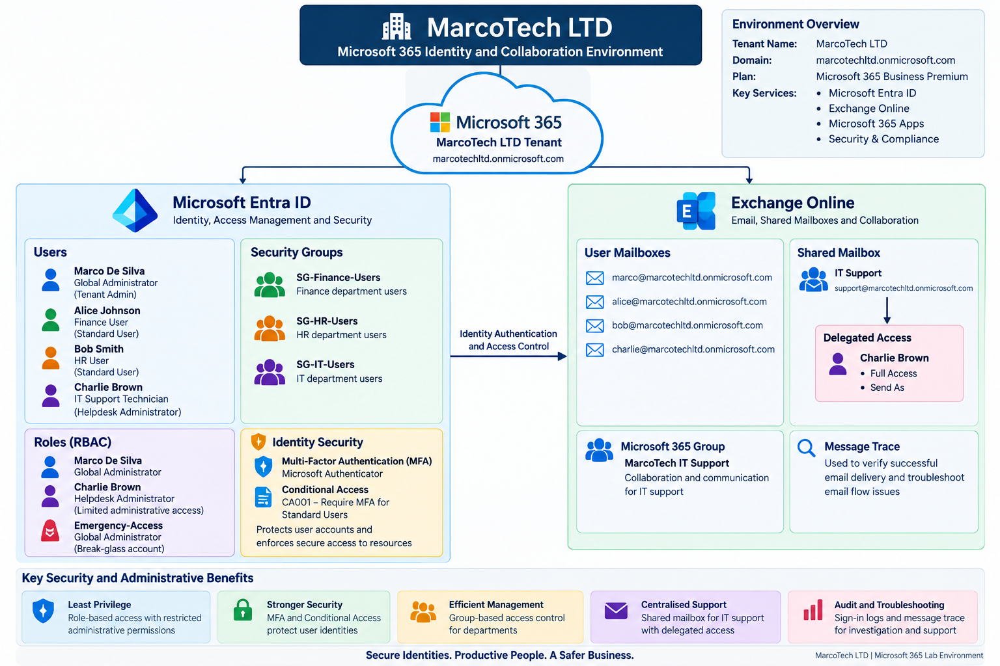

The environment separates identity and access management from productivity services. Microsoft Entra ID provides identity, authentication, group management, RBAC, MFA and Conditional Access controls, while Exchange Online provides mailbox and email services.

## Test Users

| User | Department / Function | Access |
|---|---|---|
| Alice Johnson | Finance | Standard user / Finance security group |
| Bob Smith | Human Resources | Standard user / HR security group |
| Charlie Brown | IT Support | IT security group / Helpdesk Administrator |
| Emergency Access Admin | Emergency administration | Global Administrator |

Charlie was deliberately assigned the **Helpdesk Administrator** role instead of Global Administrator to demonstrate the **Principle of Least Privilege**.

## Implementation

### 1. User and Licence Management

I started by creating user accounts in Microsoft Entra ID to represent employees working in different departments at MarcoTech LTD.

The test users included:

- **Alice Johnson** — Finance
- **Bob Smith** — Human Resources
- **Charlie Brown** — IT Support

I configured the user accounts with appropriate profile information and assigned Microsoft 365 Business Premium licences where required. This helped me understand the relationship between an Entra ID identity and the Microsoft 365 services provided through licensing.

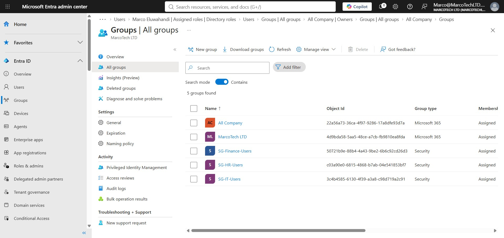

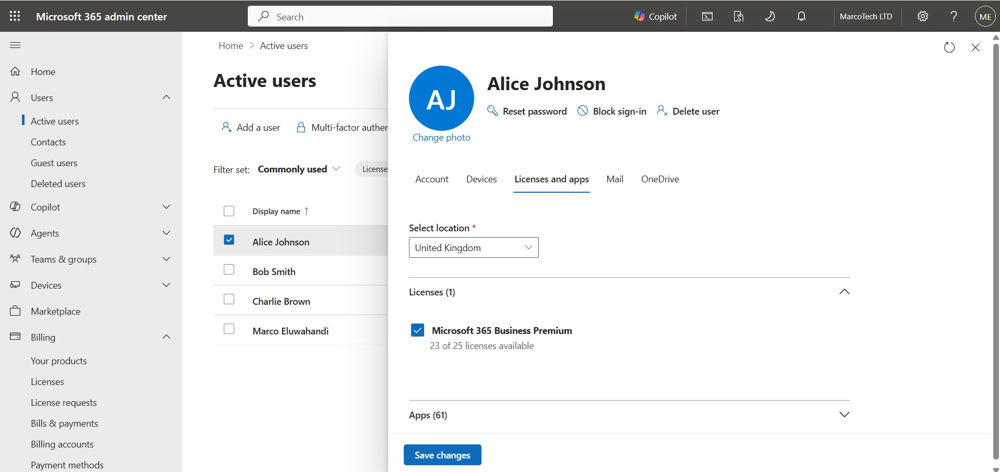

---

### 2. Security Groups and Access Management

I created departmental security groups to organise users and manage access based on their job function.

The groups used in the lab were:

- `SG-Finance-Users`
- `SG-HR-Users`
- `SG-IT-Users`

For example, Alice was added to `SG-Finance-Users` because she was acting as the Finance user in the lab.

Using security groups provides a more manageable approach to access control than assigning permissions individually to every employee.

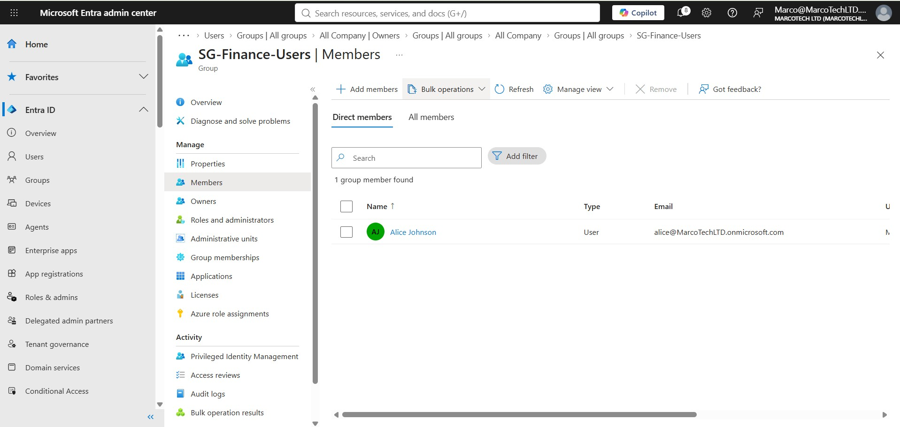

---

### 3. Role-Based Access Control (RBAC)

I used Microsoft Entra ID roles to practise the Principle of Least Privilege.

Charlie was the IT Support Technician in the lab. Instead of assigning him the highly privileged Global Administrator role, I assigned him the **Helpdesk Administrator** role.

This gave the support account administrative capabilities relevant to its job function without providing unrestricted control of the Microsoft 365 environment.

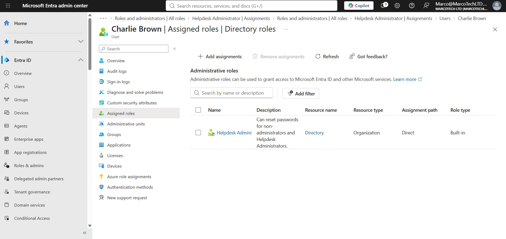

I also created an emergency access administrator account with the Global Administrator role to explore the concept of maintaining emergency administrative access.

> **Security note:** In a production environment, emergency access accounts require additional planning, monitoring and protection. The account in this project was created only as part of the lab exercise.

### 4. Multi-Factor Authentication and Conditional Access

I configured Multi-Factor Authentication (MFA) using Microsoft Entra Conditional Access to strengthen authentication for standard users.

I created the following Conditional Access policy:

**Policy:** `CA001 - Require MFA for Standard Users`

The policy targeted the standard lab users and required MFA when accessing Microsoft 365 resources.

Before enforcing the policy, I configured it in **Report-only** mode. This allowed me to observe how the policy would affect user sign-ins before enabling it.

During testing, the Conditional Access result showed that additional user action was required because the user had not yet satisfied the MFA requirement.

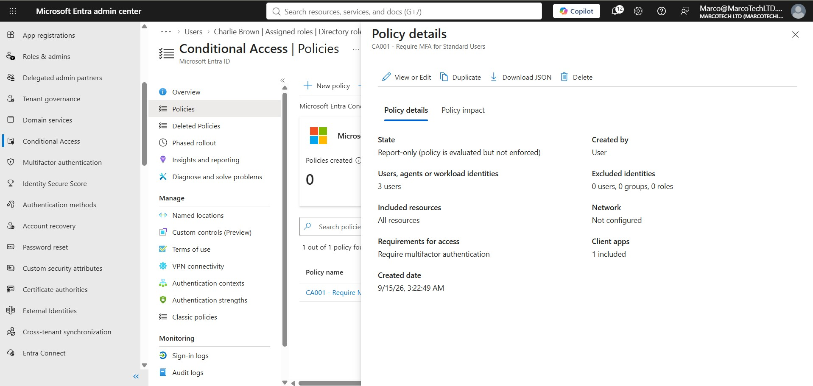

---

#### MFA Registration

I registered Microsoft Authenticator as an authentication method for the test user.

This provided a second authentication factor in addition to the user's password.

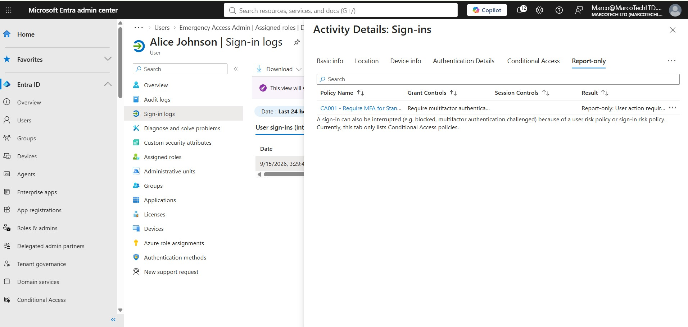

---

#### Conditional Access Testing

After confirming the policy configuration and MFA registration, I enabled the Conditional Access policy and performed another user sign-in test.

I then reviewed the Microsoft Entra sign-in logs to verify that the authentication requirement had been satisfied.

The successful sign-in showed that Multi-Factor Authentication was required and that the MFA requirement had been successfully met.

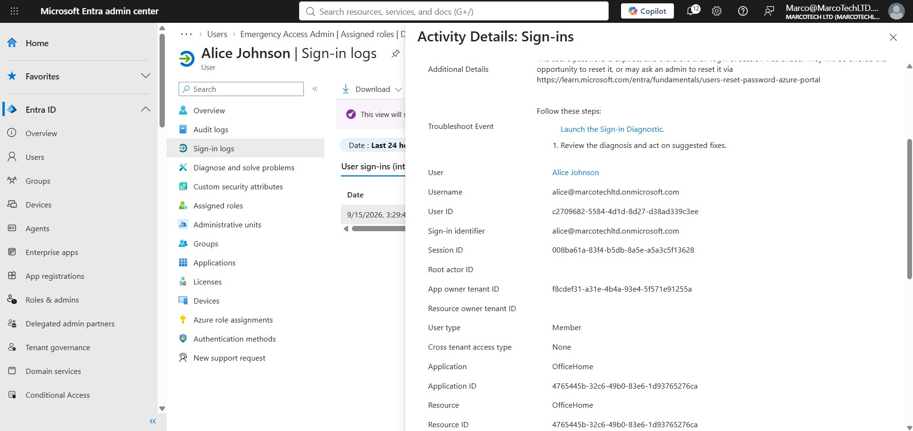

This exercise helped me understand the difference between simply enabling MFA and using Conditional Access to control when additional authentication requirements are applied.

It also demonstrated the importance of testing Conditional Access policies before enforcement to reduce the risk of accidentally locking users or administrators out of an environment.

### 5. Exchange Online Administration

I used the Exchange Admin Center to practise mailbox administration and email access management.

#### IT Support Shared Mailbox

I created an **IT Support** shared mailbox to simulate a central support address that employees could use instead of contacting an individual IT technician.

The shared mailbox used the address:

`support@<tenant>.onmicrosoft.com`

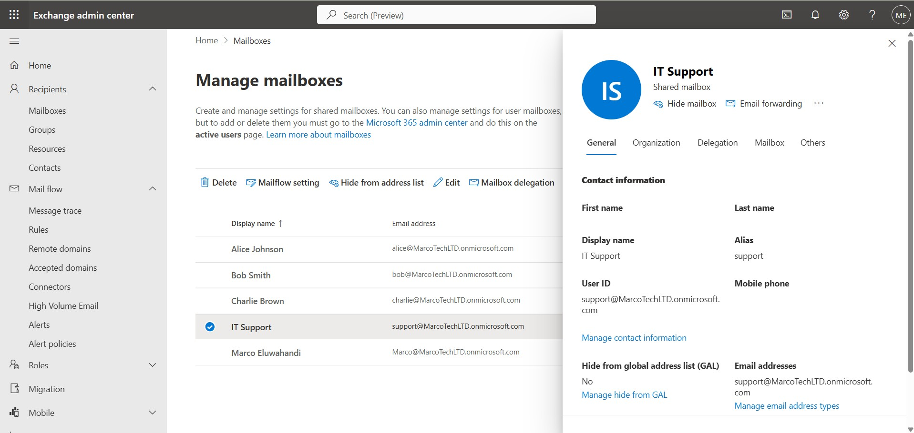

---

#### Mailbox Delegation

Charlie Brown was acting as the IT Support Technician, so I delegated access to the IT Support shared mailbox.

I configured:

- **Full Access / Read and manage** — allowing Charlie to open and manage the shared mailbox.
- **Send As** — allowing Charlie to send messages that appear to come directly from the IT Support mailbox.

Access was limited to the IT support user rather than being provided to unrelated employees.

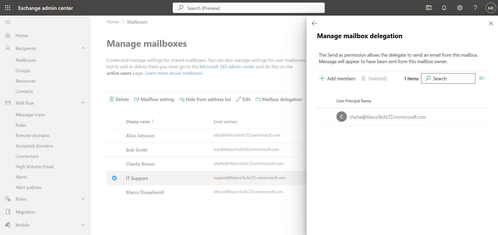

---

#### Send As Testing

After configuring the permissions, I signed in as Charlie and accessed the shared mailbox.

I then sent a test email from the IT Support address to Alice Johnson.

The message was successfully received with **IT Support** shown as the sender, confirming that the Send As delegation was working correctly.

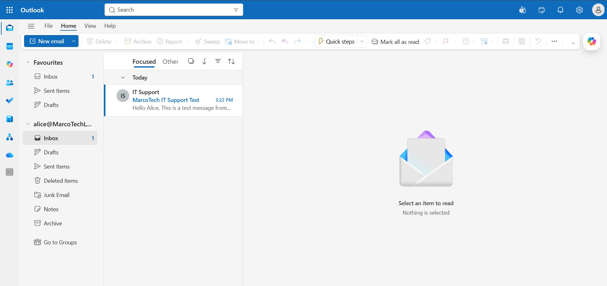

---

#### Exchange Message Trace

I used **Exchange Online Message Trace** to verify the delivery of the test email.

The trace allowed me to check the sender, recipient, timestamp and delivery status. The test message showed a **Delivered** status, confirming that Exchange Online had successfully processed and delivered the message.

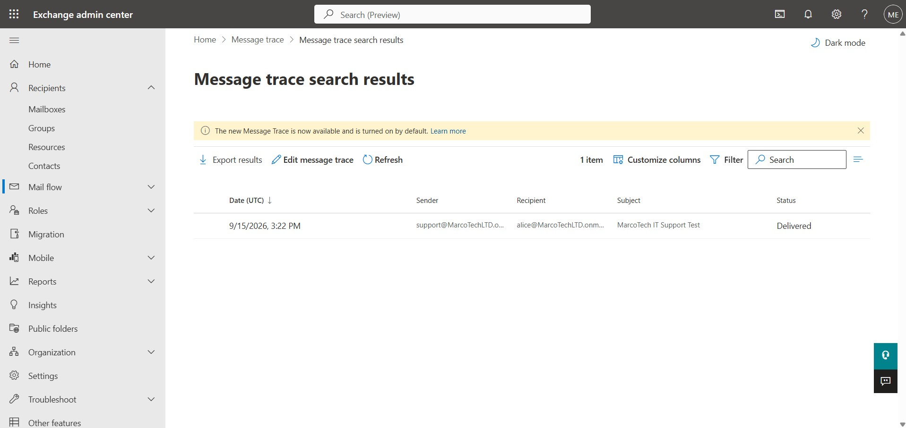

This exercise gave me practical experience with shared mailbox administration, mailbox delegation, Send As permissions and basic Exchange Online mail-flow troubleshooting.

### 6. Identity and Sign-in Troubleshooting

To practise identity troubleshooting, I simulated a scenario where Bob Smith from HR was unable to sign in to Microsoft 365.

Rather than immediately resetting the account, I used **Microsoft Entra sign-in logs** to investigate the authentication failure.

#### Investigating the Failed Sign-in

I located Bob's failed interactive sign-in event and reviewed the authentication details.

The sign-in log showed:

- **Status:** Failure
- **Error code:** `50126`
- **Failure reason:** Invalid username or password

This indicated that the authentication problem was related to the user's credentials rather than the Conditional Access policy.

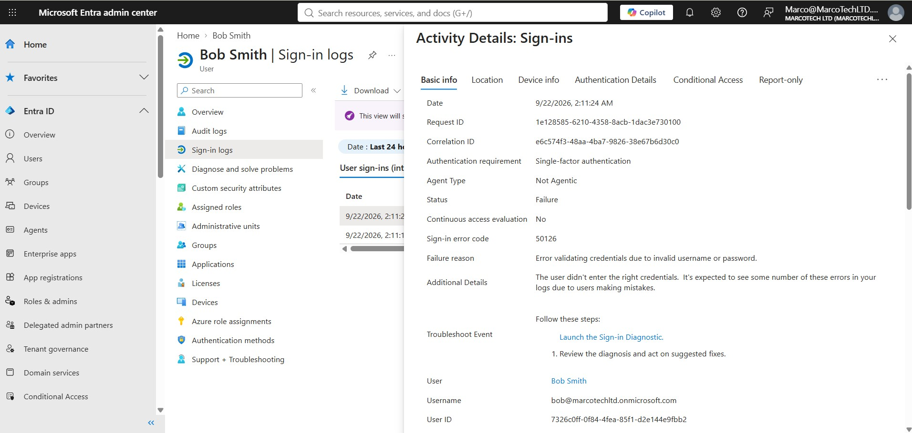

---

#### Remediation and Verification

After identifying the cause, I performed an administrator password reset and tested the account again using the new credentials.

Because Bob was included in the Conditional Access policy, MFA requirements also applied during the authentication process.

I then returned to the Entra sign-in logs and verified that the new authentication attempt completed successfully.

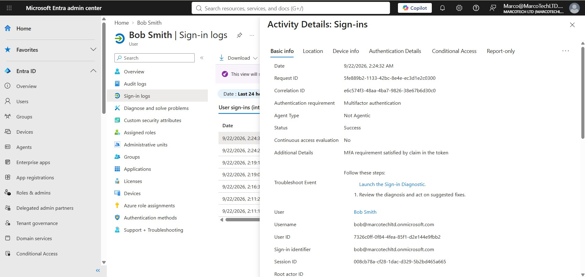

The troubleshooting process followed this workflow:

**User reports issue → Review sign-in logs → Identify failure reason → Remediate the account → Test authentication → Verify successful sign-in**

This exercise helped me understand why sign-in logs are important when troubleshooting Microsoft 365 authentication problems. Instead of assuming the cause, I used the available log information and error code to identify the issue before applying a fix.
